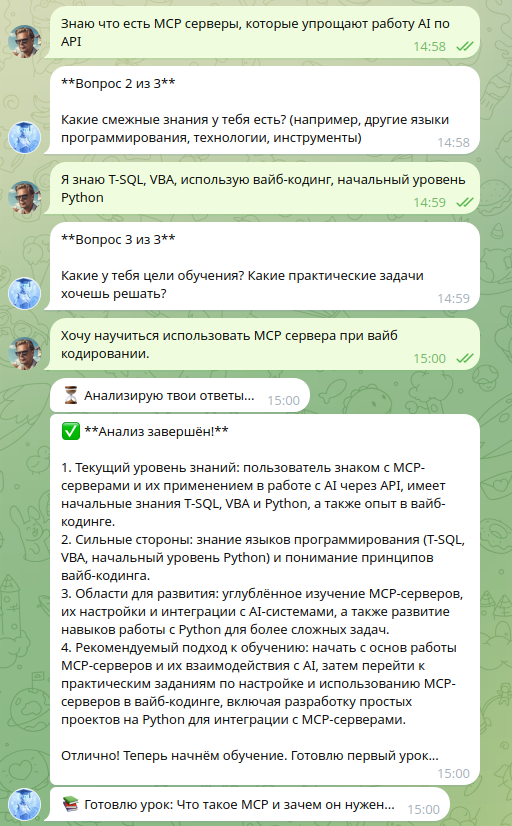
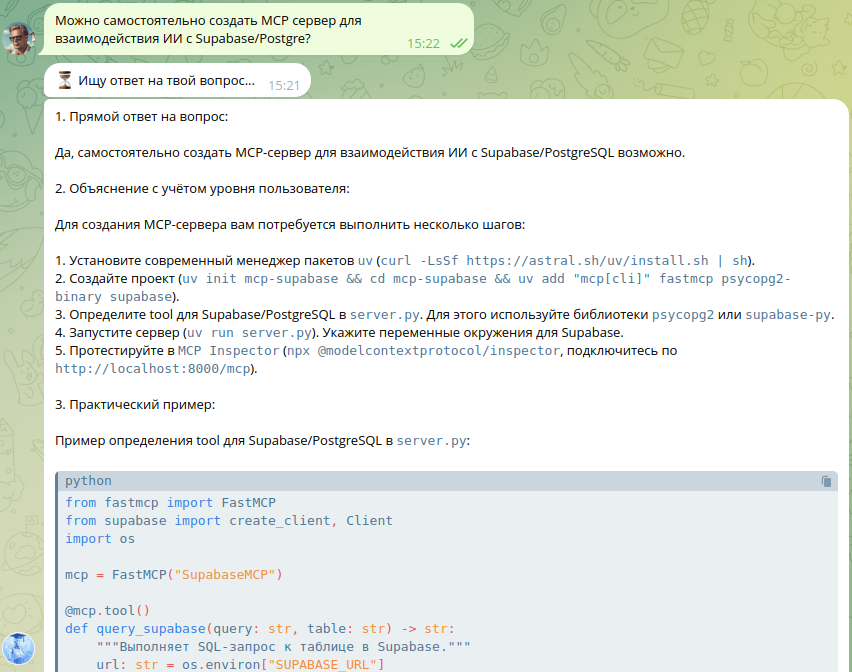
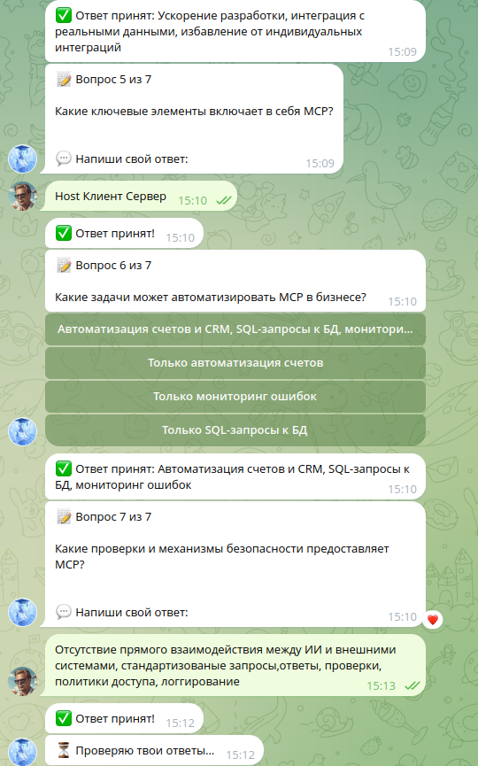
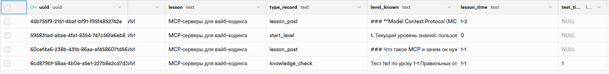

# Инструкция по работе с AI-ботом для изучения вайб-кодинга
**Описание скриншотов** 📸

---

[⬅️ Вернуться к описанию проекта](../README.md)

---

Добро пожаловать в интерактивную образовательную платформу! Вот пошаговое руководство по работе с ботом.

## 1. Запуск обучения (/start)

Нажмите команду **`/start`** для начала обучения.


Бот предложит заполнить **анкету для определения уровня подготовки** (3-5 вопросов о вашем опыте с Python, Linux, AI-инструментами).

## 2. Определение уровня

После заполнения анкеты бот **анализирует ваши ответы** и определяет уровень подготовки:

```
🟢 Продвинутый — переход к сложным темам

🟡 Средний — стандартный курс

🔴 Новичок — с подробными объяснениями
```



## 3. Подготовка персонализированного урока

Бот **формирует урок под ваш уровень**:

```
🔄 Готовим материалы под ваш уровень...

⏳ Анализируем ваши знания и предпочтения...

✨ Урок готов!
```


## 4. Изучение урока

Получите **структурированный пост-урок** с:
- Теорией и примерами кода
- Практическими заданиями
- Объяснениями на вашем уровне


## 5. Дополнительные ресурсы

Каждый урок содержит **ссылки для углубленного изучения**:
- Официальная документация
- Видеоуроки на YouTube  
- Репозитории GitHub с примерами
- Статьи и туториалы


## 6. Задавайте вопросы в любой момент

**В любой момент обучения** можно задать свой вопрос:

```
❓ У вас есть вопросы по теме?

💬 Просто напишите их здесь!
```

**Получите развернутый ответ** с примерами и пояснениями:



## 7. Тестирование знаний

**В конце каждого урока** — тест для проверки усвоения:

```
📝 Проверка знаний

✅ Правильные ответы = переход к следующему уроку

❌ Неправильные = повтор слабых тем
```



**Логика тестирования:**
- ✅ **70% и более правильных** → следующий урок
- ❌ **Менее 70% правильных** → повтор проблемных тем
- 📊 **Статистика** по темам


## 8. История обучения

**Вся активность сохраняется** в базе данных:

```
📊 Ваша статистика:

✅ Уроки пройдено: 2

📈 Уровень знаний: 78,34%

🎯 Слабые темы: асинхронность, Docker
```



## Команды быстрого доступа

```
/start     — начать/перезапустить обучение

/help      — справка по боту
```

## 🎯 Особенности системы

✅ **Адаптивность** — уроки подстраиваются под ваш уровень  

✅ **Контекстность** — бот помнит всю историю общения  

✅ **Интерактивность** — вопросы и ответы в реальном времени  

✅ **Прогресс-трекинг** — вся статистика в одном месте  

✅ **Гибкость** — можно задавать вопросы в любой момент  


---

[⬅️ Вернуться к описанию проекта](../README.md)

---

*Система автоматически подстраивается под ваш темп обучения и стиль восприятия! 🚀*
```
